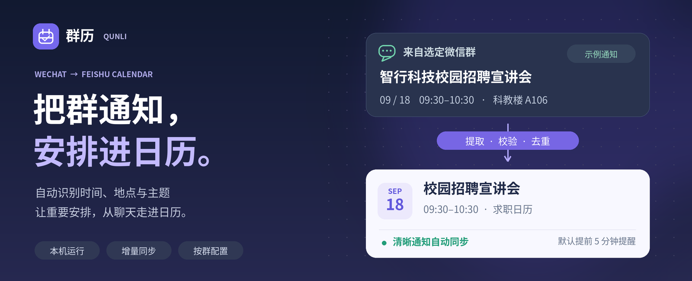
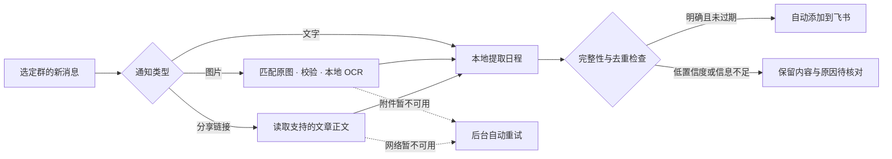
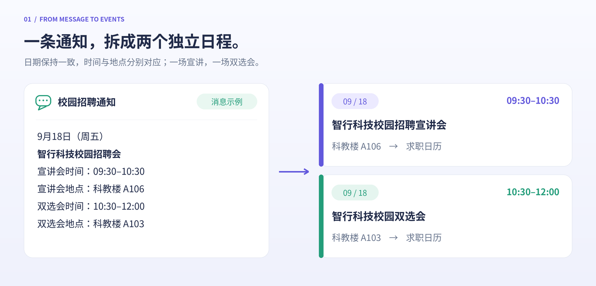
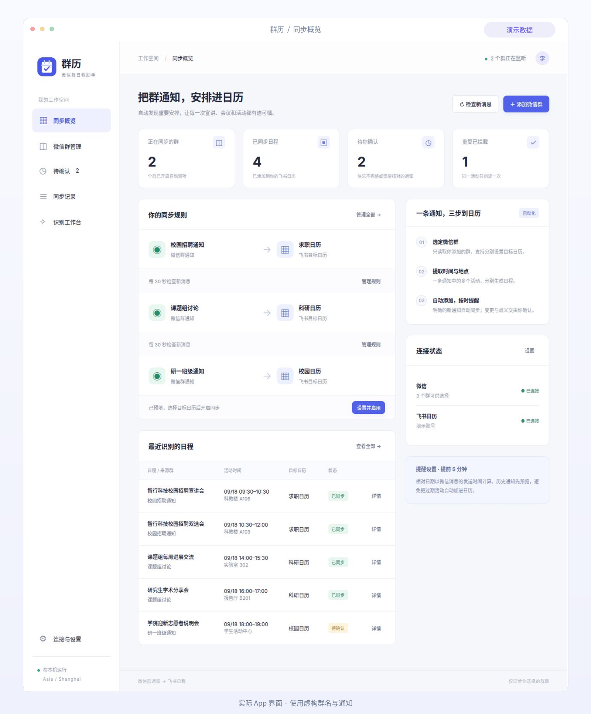
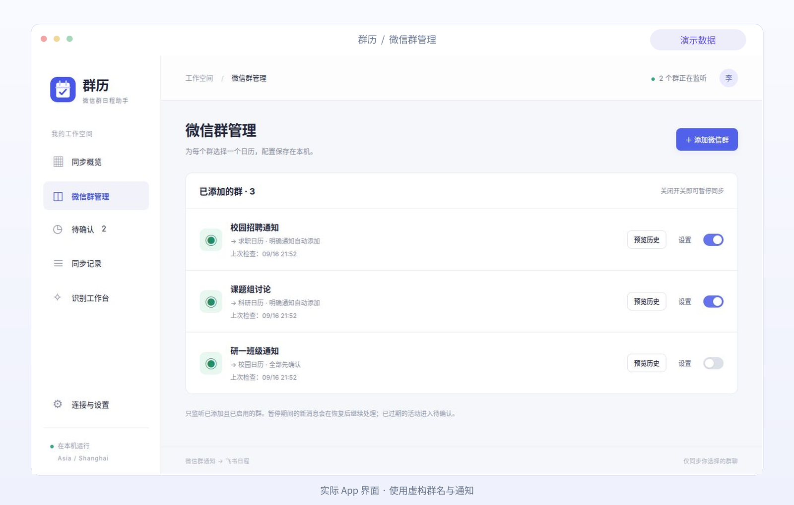
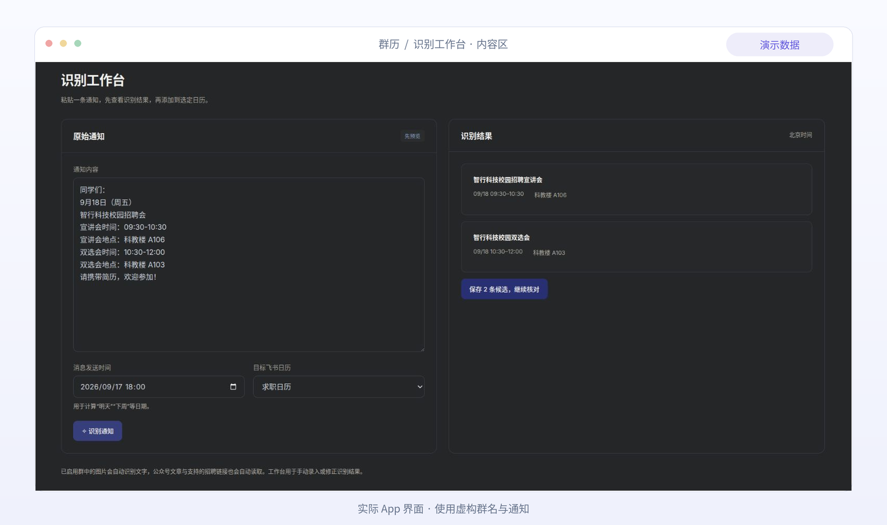
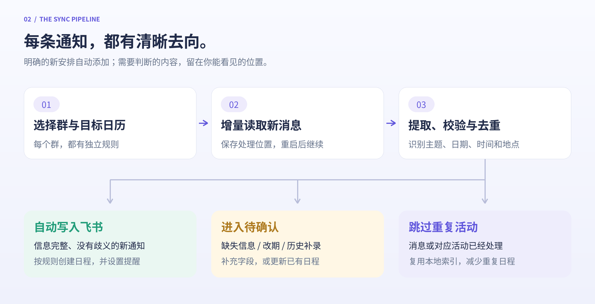
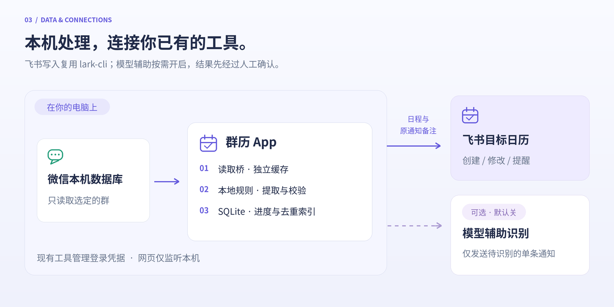

<p align="center">
  
</p>

<h1 align="center">群历 · 微信群日程助手</h1>

<p align="center">
  从选定微信群的文字、通知图片和文章分享中，提取时间、地点和主题，自动添加到你的飞书日历。<br>
  <b>适合班级通知、招聘宣讲、课题组会议与校园活动。</b>
</p>

<p align="center">
  <code>Linux</code> · <code>Python 3.12+</code> · <code>SQLite</code> · <code>原生 JavaScript</code><br>
  <b>30 秒</b> 默认检查间隔　／　<b>1 → N</b> 多活动拆分　／　<b>5 分钟</b> 默认提前提醒
</p>

<p align="center">
  <a href="#features">功能一览</a> ·
  <a href="#preview">界面预览</a> ·
  <a href="#workflow">同步流程</a> ·
  <a href="#quickstart">快速开始</a> ·
  <a href="#data">数据流向</a> ·
  <a href="docs/guide.md">完整使用指南</a>
</p>

---

<a id="features"></a>

## 功能一览

| | 能做什么 | 使用场景 |
| :---: | :--- | :--- |
| 👥 | **按群设置规则**：选择微信群、目标飞书日历与处理方式 | 招聘群进求职日历，课题组群进科研日历 |
| 🔄 | **增量读取**：保存消息处理位置，重启后继续 | 默认每 30 秒检查，只处理后续新消息 |
| 🖼️ | **图片自动识别**：准确定位本机原图、校验并进行本地 OCR | 招聘海报、会议截图中的时间与地点自动进入日程 |
| 🔗 | **文章自动读取**：公众号正文与云就业宣讲详情，必要时识别正文内图片 | 转发的招聘链接也能提取活动安排 |
| 🗓️ | **一条通知，多条日程**：分别提取每个环节的时间与地点 | 同一条招聘通知中的宣讲会与双选会 |
| 📌 | **截止日期事项**：明确要求某天完成的填报、核对、提交任务生成全天日程 | “今天需完成信息补充”，保留原通知和链接，不占用全天忙碌时间 |
| 🧑‍🎓 | **个人条件筛选**：保存自己的性别、年级和关键词，自动判断“某年级男生”等人员范围 | 匹配到自己时直接同步，不匹配时跳过，资料不足才待确认 |
| ✨ | **自动添加与提醒**：明确的新通知直接写入飞书 | 默认提前 5 分钟提醒，也可修改 |
| 🤖 | **DeepSeek Flash 后备识别**：复用本机 DeepSeek Anthropic 配置补充解析模糊通知 | 只发送单条通知，模型结果仍进入待确认 |
| ✍️ | **核对与更新**：模糊信息、取消和改期进入待确认 | 补充信息，或更新由 App 管理的已有日程 |
| 🧩 | **去重与重试**：保留消息索引和创建请求编号 | 拦截重复活动，失败后沿用原请求重试 |
| 🔎 | **历史预览与手动补录**：先识别、再核对、再录入 | 预览近期群通知，或直接粘贴通知文字 |
| 🌙 | **后台运行**：应用菜单入口 + 用户级 systemd 服务 | 关闭网页后，已启用的群仍继续检查 |

### 文字、海报和推文，自动进入同一个日历



### 一条消息，怎样变成日程？



> 图中为虚构通知。示例分别生成 **09:30–10:30 的宣讲会**和 **10:30–12:00 的双选会**，两条日程保留各自的教室。相对日期以消息发送时间计算。

<a id="preview"></a>

## 界面预览

**同步概览：群与日历如何对应、哪些内容已同步、哪些需要确认，一眼可见。**

[](docs/assets/overview.png)

<table>
  <tr>
    <th width="50%">按群管理</th>
    <th width="50%">识别工作台</th>
  </tr>
  <tr>
    <td><a href="docs/assets/groups.png"></a></td>
    <td><a href="docs/assets/lab.png"></a></td>
  </tr>
  <tr>
    <td align="center">一个群、一套规则，随时开启或暂停。</td>
    <td align="center">左侧粘贴通知，右侧核对识别结果。</td>
  </tr>
</table>

<sub>以上截取自实际 App 的独立演示环境，群名、账号与通知均为示例数据。点击图片可查看大图。</sub>

<a id="workflow"></a>

## 同步流程



默认自动模式下，**明确的新通知自动添加**；缺失信息、日期与星期冲突、改期或历史补录先进入“待确认”。也可以给某个群设置“所有通知都先确认”。

在“连接与设置”中可以填写自己的个人信息：性别、年级 / 入学年份，以及可选的个人关键词。通知中出现“某年级全体男生”“女生专场”等人员条件时，群历会逐项判断：明确匹配的活动直接写入飞书，明确不匹配的活动跳过，只有资料不足或条件无法判断时才进入“待确认”。匹配成功的日程备注会记录已使用的个人条件，方便追溯。个人资料只保存在本机 SQLite，不会写入仓库或同步到第三方。

普通会议只写了一个开始时间时，群历会把下一场的开始时间作为上一场的结束时间；最后一场默认按 30 分钟估算，并保留待确认提示。若个人条件已经明确匹配，30 分钟只是缺少结束时间的合理默认值，不会再单独阻止自动同步。

明确到某一天、没有具体时刻的截止事项会显示为 **全天 · 截止事项**。普通会议缺少结束时间时仍需补充；带有具体截止时刻的通知不会被自动降成全天。全天事项不另设提醒时刻，原有“提前 5 分钟”设置用于有起止时间的活动。

如果消息已读取但尚未写入，概览和群管理页面会显示提示。进入“待确认”可查看消息时间、发送人和具体原因；文字、图片和支持的文章分享均支持 **重新识别**，补录仍沿用原消息的去重记录。

- **进度可持续**：处理位置保存在本机，服务重启后继续读取。
- **操作可追溯**：“同步记录”保留来源群、目标日历与处理结果。
- **失败可重试**：创建失败后沿用同一个请求编号；更新失败后继续更新原日程。

<a id="quickstart"></a>

## 快速开始

先准备 **Python 3.12+**、已登录的本机微信、可读取消息的 **wechat-cli** 环境，以及已登录的官方 **lark-cli**。App 核心仅使用 Python 标准库；图片功能使用独立的本地 OCR 环境。

```bash
git clone https://github.com/keeperlibofan/wechat-feishu-calendar.git
cd wechat-feishu-calendar

# 改成你已配置完成的 wechat-cli 源码目录
export WECHAT_CLI_DIR="$HOME/文档/wechat/wechat-cli"

# 首次启用图片识别时安装本机 OCR（已有兼容环境可指定 CALENDAR_OCR_PYTHON）
/usr/bin/python3 scripts/install_ocr.py

python3 -m app
```

打开 **<http://127.0.0.1:8766>**，完成这三步：

| ① 检查连接 | ② 配置微信群 | ③ 开启同步 |
| :--- | :--- | :--- |
| 确认本机微信与飞书账号可用 | 搜索群名，选择目标日历和处理模式 | 明确的新通知自动写入，其他内容进入待确认 |

随后在“连接与设置 → 我的个人信息”填写自己的性别、年级 / 入学年份和可选关键词。这个设置只影响人员条件筛选，不会修改原始微信消息。

安装应用菜单与登录后的后台服务：

```bash
/usr/bin/python3 scripts/install.py
```

需要自定义微信工具路径、端口、数据目录或管理后台服务，请看 **[完整安装与使用指南](docs/guide.md)**。源码目录应长期保留，安装后的服务直接引用该目录。

### 飞书连接：复用现有登录

App 直接调用本机 `lark-cli`。已有权限会继续复用，按实际功能补充缺少的权限即可。

| 功能 | 对应权限 |
| :--- | :--- |
| 列出可选日历 | `calendar:calendar:read` |
| 创建日程 | `calendar:calendar.event:create` |
| 修改日程 | `calendar:calendar.event:update` |

已有主日历写入权限时，使用主日历无需重复授权。如需读取完整日历列表，在“选择更多日历”中补充授权，完成后点击“我已完成授权”。

<a id="data"></a>

## 数据流向



- **本机网页**：仅监听 `127.0.0.1`，默认配置与索引位于 `~/.local/share/wechat-feishu-calendar/app.db`。
- **微信读取**：只读取选定的群，使用独立解密缓存，不修改原始微信数据库。
- **图片与文章**：本机图片解密与 OCR 不调用云端模型；读取分享的公开文章时会访问原文网站。原图和识别缓存仅保存在本机私有目录。
- **飞书日程**：活动信息及原通知备注发送到你选定的日历，登录凭据由现有工具管理。
- **模型辅助**：默认关闭。启用后，优先使用本机已有的 `deepseek-v4-flash` Anthropic 兼容配置；没有 DeepSeek 配置时回退到本机 Codex Responses 配置。仅将需要辅助识别的单条通知发送给模型，提取结果先进入人工确认。

## 常见问题

<details>
<summary><b>关闭网页以后，还会继续同步吗？</b></summary>

安装并启用后台服务后会继续。电脑需要保持运行，微信需要在本机接收新消息。暂停某个群只需关闭对应的同步开关。

</details>

<details>
<summary><b>为什么以前的通知没有自动添加？</b></summary>

添加群时从当前时间开始读取。历史通知可以用“预览历史”手动补录，每次预览最近 3 天的首批最多 500 条消息；保存候选后仍需确认。

</details>

<details>
<summary><b>图片和微信推文还需要手动复制吗？</b></summary>

不需要。已启用群中的图片会自动从本机微信附件中读取、校验并识别文字，再进入同一套日程提取与去重流程。原图尚未下载完整或网站暂时不可用时，后台自动重试。

目前支持 `mp.weixin.qq.com` 公众号文章和 `m.bysjy.com.cn` / `s.bysjy.com.cn` 云就业宣讲详情；公众号文字没有完整安排时，会尝试读取正文前 6 张图片。低置信度、信息缺失、访问验证、超出支持范围或已结束活动会保留原因供核对。语音、视频及文件正文仍不自动解析。详细依赖与限制见 [图片与文章识别](docs/media.md)。

</details>

<details>
<summary><b>模型识别使用哪个模型？</b></summary>

如果本机已有 DeepSeek Anthropic 兼容配置，群历会优先使用轻量的 `deepseek-v4-flash`；它只处理本地规则无法完整解析的单条通知，不接收整段聊天记录，也不会直接绕过待确认写入日历。需要使用账号中另一个型号时，可通过 `CALENDAR_DEEPSEEK_MODEL` 指定，例如 `deepseek-v4.1-flash`（前提是该型号已在接口中开放）。没有 DeepSeek 配置时，群历仍可使用本机 Codex Responses 配置。

</details>

<details>
<summary><b>已经有的日程，会重复创建吗？</b></summary>

App 对已处理消息和已管理、已导入的活动做本地去重。飞书中其他手动创建、未导入的日程不在去重索引内。

</details>

<details>
<summary><b>人员条件是怎样处理的？</b></summary>

例如个人信息填写为“男生、2028 级”，通知写明“28 级全体男生”时会直接同步；“28 级女生”或“27 级全体”会跳过；只写“28 级全体”而没有性别冲突时可以匹配年级，资料缺失或条件含义不完整时才进入待确认。个人信息保存在本机数据目录，不会写入公开仓库。

</details>

<details>
<summary><b>取消通知、移除群规则会删除日程吗？</b></summary>

取消和变更进入待确认，不自动删除已有日程。移除群规则保留已创建的飞书日程。App 不添加其他参会人，也不预订会议室。

</details>

## 开发与验证

```bash
python3 -m venv .venv
.venv/bin/pip install -r requirements-dev.txt
.venv/bin/python -m pytest -q
node --check app/static/app.js
```

**当前验证记录：74 项 Python 测试通过**，JavaScript 语法与 Python 编译检查通过。测试使用模拟接口，不向微信发消息或向真实飞书写入测试日程。完整范围见 [VERIFICATION.md](VERIFICATION.md)。

| 模块 | 职责 |
| :--- | :--- |
| `app/service.py` | 增量扫描、候选处理、发布与去重 |
| `app/extractor.py` | 本地通知解析与日程校验 |
| `app/wechat_bridge.py` | 微信数据库读取桥 |
| `app/wechat_media.py` / `app/ocr_bridge.py` | 本机附件定位、校验、解密与 OCR |
| `app/articles.py` | 公众号和招聘详情读取 |
| `app/adapters.py` | 微信、飞书与可选模型接口 |
| `app/store.py` | SQLite 持久化 |
| `app/static/` | 六个页面的原生网页界面 |

---

<p align="center">
  <b>群里的安排，日历里见。</b><br>
  <sub>本仓库包含代码、文档与示例素材，不包含个人聊天数据库、登录凭据或授权二维码。</sub><br>
  <sub><a href="docs/guide.md">使用指南</a> · <a href="VERIFICATION.md">验证记录</a> · <a href="docs/README.md">文档素材维护</a></sub>
</p>
